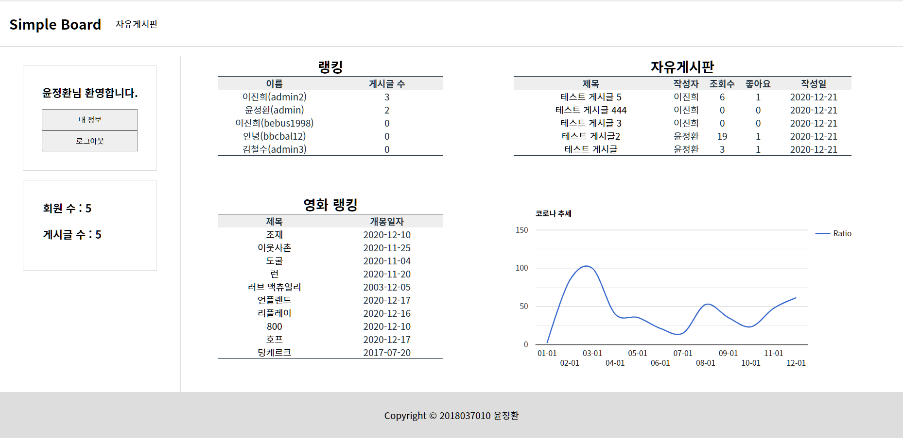

# Term Project



<br>

<details>
<summary>목차</summary>

- [과제 주제 설명](#과제-주제-설명)
- [주요 코드 설명](#주요-코드-설명)
  - [사용 API](#사용-API)
  - [전체적인 구조](#header)
- [비고 및 고찰](#비고-및-고찰)

</details>

<br>

# 과제 주제 설명

9주차에 나온 주소 검색 API를 이용한 예제 업그레이드

<br>

# 주요 코드 설명

## 사용 API

- 도로명주소 개발자센터 도로명주소 API
- 카카오 지도 API

## 전체적인 구조

```html
<div class="grid-container">...</div>
```

```css
.grid-container {
  display: grid;
  grid-template-areas:
    "header"
    "main"
    "footer";
  grid-template-columns: 1fr;
  grid-template-rows: 5rem 1fr 5rem;
  height: 100%;
}
```

- grid-container를 통해 header, main, footer를 감싸주었고, grid를 사용해 전체적인 레이아웃을 구성하였다.

## 검색어 필터링

```js
function checkSearchedWord(obj) {
  if (obj.value.length > 0) {
    var expText = /[%=><]/;
    if (expText.test(obj.value) == true) {
      alert("특수문자를 입력 할수 없습니다.");
      obj.value = obj.value.split(expText).join("");
      return false;
    }

    var sqlArray = new Array(
      "OR",
      "SELECT",
      "INSERT",
      "DELETE",
      "UPDATE",
      "CREATE",
      "DROP",
      "EXEC",
      "UNION",
      "FETCH",
      "DECLARE",
      "TRUNCATE"
    );

    var regex;
    for (var i = 0; i < sqlArray.length; i++) {
      regex = new RegExp(sqlArray[i], "gi");

      if (regex.test(obj.value)) {
        alert(
          '"' + sqlArray[i] + '"와(과) 같은 특정문자로 검색할 수 없습니다.'
        );
        obj.value = obj.value.replace(regex, "");
        return false;
      }
    }
  }
  return true;
}
```

- 문제를 일으킬 수 있는 특수 문자 및 지시어들을 필터링 해주었다.

## 페이지네이션


```js
function pageMake(jsonStr) {
  var total = jsonStr.common.totalCount;
  var pageNum = form.currentPage.value;
  var paggingStr = "<nav>";
  paggingStr += "<ul class='pagination'>";
  if (total > 0) {
    var PAGEBLOCK = 5;
    var pageSize = 5;
    var totalPages = Math.floor((total - 1) / pageSize) + 1;
    var firstPage = Math.floor((pageNum - 1) / PAGEBLOCK) * PAGEBLOCK + 1;
    if (firstPage <= 0) firstPage = 1;
    var lastPage = firstPage - 1 + PAGEBLOCK;
    if (lastPage > totalPages) lastPage = totalPages;
    var nextPage = lastPage + 1;
    var prePage = firstPage - 5;
    if (firstPage > PAGEBLOCK) {
      paggingStr +=
        "<li class='page-item'><a class='page-link' href='javascript:goPage(" +
        prePage +
        ");'>◁</a></li>";
    }
    for (i = firstPage; i <= lastPage; i++) {
      if (pageNum == i)
        paggingStr +=
          "<li class='page-item active' aria-current='page'><a class='page-link' href='javascript:goPage(" +
          i +
          ");'>" +
          i +
          "<span class='sr-only'>(current)</span></a></li>";
      else
        paggingStr +=
          "<li class='page-item'><a class='page-link' href='javascript:goPage(" +
          i +
          ");'>" +
          i +
          "</a></li>";
    }
    if (lastPage < totalPages) {
      paggingStr +=
        "<li class='page-item'><a class='page-link' href='javascript:goPage(" +
        nextPage +
        ");'>▷</a></li>";
    }
    paggingStr += "</ul>";
    paggingStr += "</nav>";
    document.querySelector("#pageApi").innerHTML = paggingStr;
  }
}
```

- form에 hidden인 currentPage를 통해 현재 페이지 번호를 저장하였고, goPage(page) 함수를 통해 페이지 이동을 시켰다.

## 지도


- 검색한 위치 근처에 존재하는 편의 시설을 검색해 볼 수 있다.

```html
<a
  href='map.html?bdNm=${encodeURIComponent(item.bdNm)}&roadAddr=${encodeURIComponent(item.roadAddr)}&jibunAddr=${encodeURIComponent(item.siNm + " " + item.sggNm + " " + item.emdNm + " " + item.lnbrMnnm)}&zipNo=${encodeURIComponent(item.zipNo)}'
></a>
```

- 주소에 get방식으로 정보를 넣어 보내주었다.

```js
function getParam(sname) {
  var params = location.search.substr(location.search.indexOf("?") + 1);
  var sval = "";
  params = params.split("&");
  for (var i = 0; i < params.length; i++) {
    temp = params[i].split("=");
    if ([temp[0]] == sname) {
      sval = temp[1];
    }
  }
  return sval;
}
```

- getParam 함수로 get방식으로 받은 파라미터를 name으로 value를 읽어온다

```js
var content =
  '<div class="wrap">' +
  '    <div class="info">' +
  '        <div class="title">' +
  `            ${bdNm}` +
  '            <div class="close" onclick="closeOverlay()" title="닫기"></div>' +
  "        </div>" +
  '        <div class="body">' +
  '            <div class="desc">' +
  `                <div class="ellipsis">${roadAddr}</div>` +
  `                <div class="jibun ellipsis"> ${jibunAddr} (우) ${zipNo}</div>` +
  `                <div><a href="https://map.kakao.com/link/search/${encodeURIComponent(
    roadAddr
  )}" target="_blank" class="link">카카오맵 이동</a></div>` +
  "            </div>" +
  "        </div>" +
  "    </div>" +
  "</div>";
```

- 그 후 카카오 지도 API에 도로명을 검색하여 좌표를 찾아 위치를 표시하고 getParam 함수로 읽어온 정보를 커스텀 마커로 표현해준다.
- 커스텀 마커는 건물 이름, 도로명, 지번 주소, 우편 번호, 카카오맵 이동을 보여준다.

## 카카오맵


- 카카오맵 이동 클릭시 검색한 주소를 카카오맵에서 찾아 보여줌


- 편의 시설 마커의 상단을 클릭시 카카오맵에서 해당 정보를 보여줌

<br>

# 비고 및 고찰

전 과제에서 CSS의 Transition, Transform, Animation 들을 사용하면서 생동감있는 웹 페이지를 작성해보고 자바스크립트를 조금 사용하여 side bar를 열리고 닫히는 효과를 구현하면서 틀 뿐만 아니라 생동감이 있는 웹을 만들어 보았었다. 이번 과제에서는 자바스크립트를 좀 더 활용하여서 API를 사용해보고 버튼이나 앵커 태그를 클릭시 특정 기능을 수행하도록 하였다. 이제야 제대로 된 웹을 만든 것 같았다. 기존까지는 그냥 보여지는게 전부였는데 이번 과제는 API를 통해 정보를 가져와 보여주는 기능들까지 더해져 사용자가 원하는 기능을 제공할 수 있도록 웹 페이지를 작성하였다. 이번 과제의 기능을 늘리기 위해 페이지네이션, 주소 클릭시 지도 상에 정보 및 위치가 표시되게 구현을 하였다. 페이지 이동시 파라미터를 넘겨주는 것이나 api를 통해 가져온 정보를 html에 표현하는 부분이 html과 css를 작성하는 것보다 어려웠다. 문법만 안다고 할 수 있는게 아닌 것 같아서 열심히 다양한 프로젝트를 해보면서 실력을 키워야 할 것 같다.
