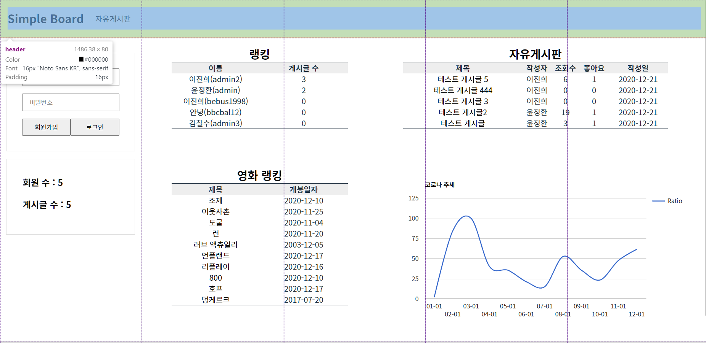
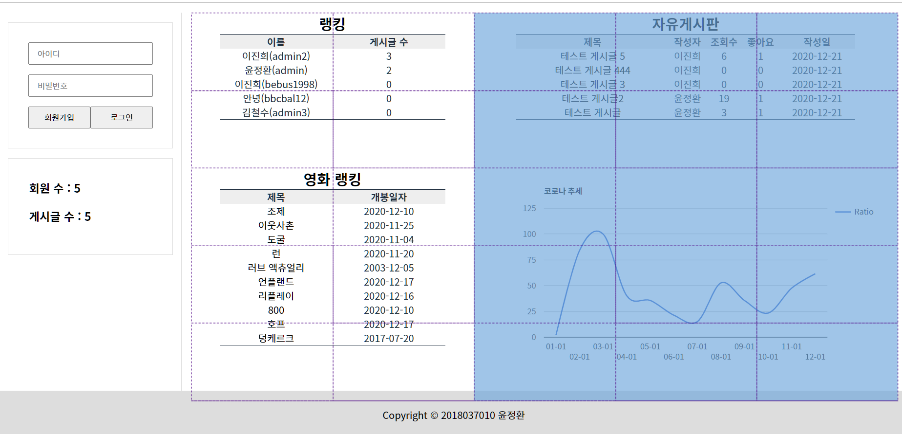
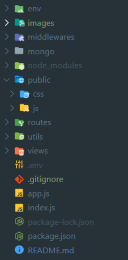
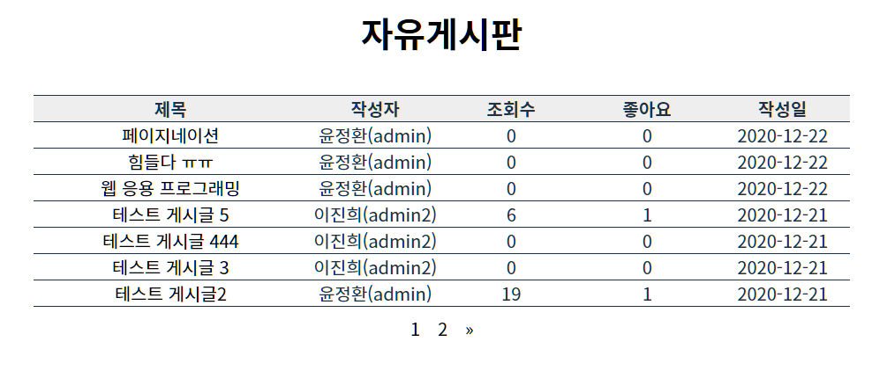
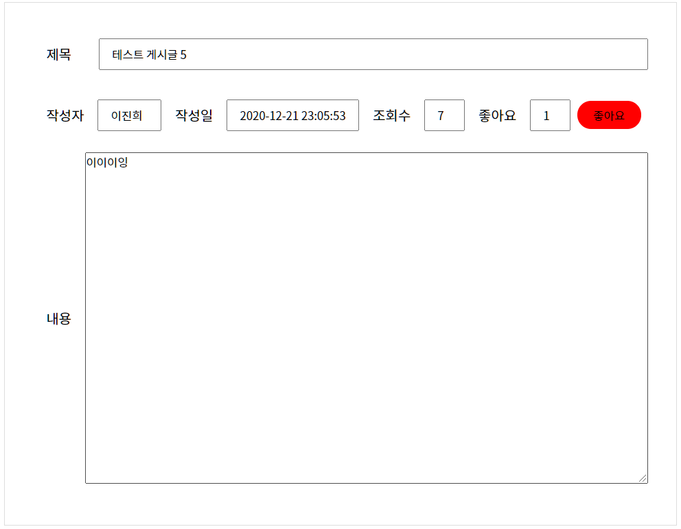
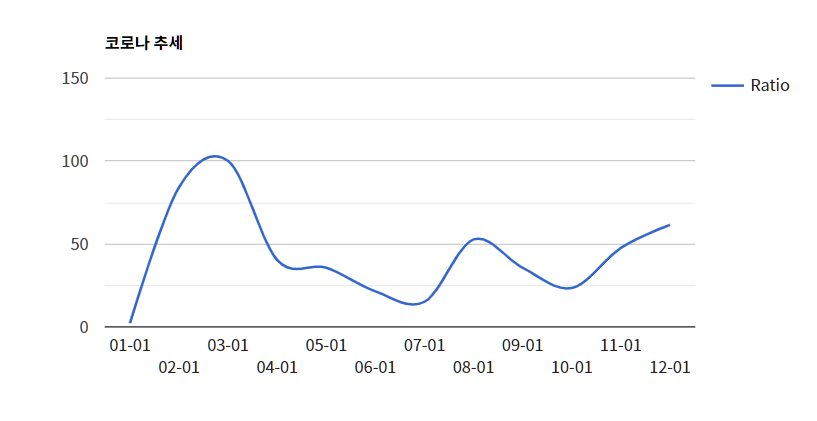
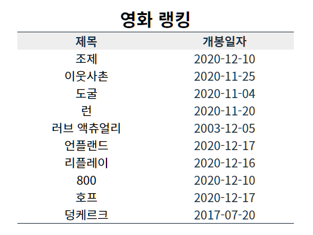
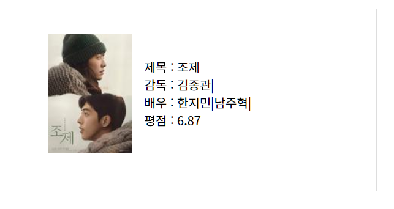

# Term Project


<br>

<details>
<summary>목차</summary>

- [프로젝트 설명](#프로젝트-설명)
- [주요 기능 설명](#주요-기능-설명)
  - [HTML, CSS](#HTML,-CSS)
  - [웹 페이지 디자인](#웹-페이지-디자인)
  - [JavaScript](#JavaScript)
  - [Node.js(Express)](<#Node.js(Express)>)
  - [MongoDB](#MongoDB)
  - [인증](#인증)
  - [기타](#기타)
- [비고 및 고찰](#비고-및-고찰)

</details>

<br>

# 프로젝트 설명

한 학기 동안 배운 내용 및 앞으로 배울 내용들을 활용하여 Term Project 진행

주제는 아래 목록 혹은 자유 주제

- 게시판 만들기
- Todo 애플리케이션 만들기
- Blog 만들기
- 기타 자유 주제

<br>

HTML, CSS, 디자인, JS, Node, DB, 인증, 기타의 7가지를 모두 적용하였습니다.

영화 소개 및 순위, 코로나 추세 그래프, 게시판 등의 기능을 담은 웹 페이지를 구현하였습니다.

<br>

# 주요 기능 설명

## HTML, CSS

- 메인, 회원가입, 내 정보 수정, 글 쓰기, 게시판, 게시판 상세, 영화 상세 등의 페이지들로 구성되어 있습니다.
- CSS는 되도록 효과에 맞는 이름으로(.효과이름) 지어서 class에 넣어 재사용하기 용이하게 하였습니다.

<br>

## 웹 페이지 디자인

- 전체적인 레이아웃은 grid를 사용해서 잡아주었고 내부는 flex를 사용해 틀을 잡아주었습니다.
- 회색, 흰색을 조합하였고 차분하면서 심플한 디자인으로 제작하였습니다.




<br>

## JavaScript

자바스크립트는 크게 2가지에 사용하였습니다.

### 1) 글 쓰기, 회원가입, 로그인할 때 입력한 정보가 적절한지 확인

- 각각의 form에 submit 이벤트를 등록하여 제출시, 입력 항목이 비어있거나 조건에 맞지 않는 값이 들어있을 경우 진행을 멈춥니다.

<br>

### 2) 코로나 추세 JSON 데이터을 API에 요청하여 받아와 그래프를 그려주기

```js
async function request() { // 코로나 추세 json 요청
  const response = await fetch("/graph", {
    method: "GET",
  });
  return response.json();
}

async function drawChart() { // json 데이터를 배열에 넣고 그래프 그리기
  const result = await request();
  let resultArray = [];
  resultArray.push(["Period", "Ratio"]);
  for (let i in result.data) {
    resultArray.push([
      result.data[i].period.substring(5, 10),
      result.data[i].ratio,
    ]);
  }

  ...

}

```

<br>

## Node.js(Express)



### 1) env 디렉터리

- 환경 변수 제공을 위한 코드 작성

### 2) middlewares 디렉터리

- Express에서 핵심이라고 할 수 있는 미들웨어 코드 작성

### 3) mongo 디렉터리

- MongoDB 연결 코드과 스키마 및 모델 생성 코드 작성

### 4) public 디렉터리

- 사용할 정적 리소스를 담아두는 디렉터리

### 5) routes 디렉터리

- 라우팅을 위한 코드 작성

### 6) views 디렉터리

- 렌더링할 템플릿 파일을 담아두는 디렉터리

### 7) .env

- 환경 변수 설정 파일

### 8) app.js

- Express Application 객체 설정

### 9) index.js

- Entry Point

<br>

## MongoDB

### 1. good.model.js (좋아요 정보) -> accId(회원 uniqueID), postId(게시글 계정 uniqueID)

### 2. post.model.js (게시글 정보) -> title(제목), content(내용), author(회원 uniqueID), views(조회수), createdAt(작성일)

### 3. user.model.js (회원 정보) -> name(이름), username(아이디), hashedPassword(암호화된 비밀번호), email(이메일)

<br>

## 인증

- 세션 기반의 로그인 인증을 구현하였습니다.
- 세션을 메모리에 저장하면 메무리 부족으로 문제가 발생하기 때문에 MongDB를 세션 스토어로 사용하였습니다.

```js
req.session.isAuthenticated = true;
req.session.user = { id: user._id, name: user.name, username };
```

- 위와 같이 로그인을 하면 세션에서 isAuthenticated, user 변수에 데이터를 넣어놓고, 아래와 같이 페이지 이동 전에 인증을 거친다.

```js
exports.requireAuthentication = (req, res, next) => {
  if (req.session.isAuthenticated) {
    next();
  } else {
    req.flash("errorMessage", "로그인 후에 사용해주세요.");
    res.redirect("/login");
  }
};
```

<br>

## 기타

### 1. 도전 과제(게시판 기능)을 구현하였습니다.

- 도전 과제에 추가로 페이지네이션과 좋아요, 조회수 기능을 구현하였습니다.




<br>

### 2. 코로나 추세 그래프를 구현 하였습니다.

- 서버에서 네이버 데이터랩 api를 통해 날짜별 검색율을 받아와 프론트에서 구글의 그래프 api를 사용해 그래프를 그려주었습니다.



<br>

### 3. 영화 상세보기와 순위 테이블을 구현하였습니다.

- 아래의 api를 사용해 영화의 순위와 상세보기 기능을 구현하였습니다.

1. 영화 진흥 위원회 API
2. 네이버 검색 API




<br>

# 비고 및 고찰

전 과제에서 CSS의 Transition, Transform, Animation 들을 사용하면서 생동감있는 웹 페이지를 작성해보고 자바스크립트를 조금 사용하여 side bar를 열리고 닫히는 효과를 구현하면서 틀 뿐만 아니라 생동감이 있는 웹을 만들어 보았었다. 이번 과제에서는 자바스크립트를 좀 더 활용하여서 API를 사용해보고 버튼이나 앵커 태그를 클릭시 특정 기능을 수행하도록 하였다. 이제야 제대로 된 웹을 만든 것 같았다. 기존까지는 그냥 보여지는게 전부였는데 이번 과제는 API를 통해 정보를 가져와 보여주는 기능들까지 더해져 사용자가 원하는 기능을 제공할 수 있도록 웹 페이지를 작성하였다. 이번 과제의 기능을 늘리기 위해 페이지네이션, 주소 클릭시 지도 상에 정보 및 위치가 표시되게 구현을 하였다. 페이지 이동시 파라미터를 넘겨주는 것이나 api를 통해 가져온 정보를 html에 표현하는 부분이 html과 css를 작성하는 것보다 어려웠다. 문법만 안다고 할 수 있는게 아닌 것 같아서 열심히 다양한 프로젝트를 해보면서 실력을 키워야 할 것 같다.
